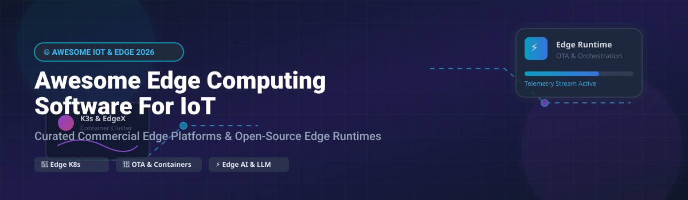

# Awesome-Edge-Computing-Software-For-IoT 🌐 📡 ⚡

  

  
  
  
  
  

---

## 🌟 Top Edge Computing Software for IoT Ecosystem 🚀

**Curated List of Commercial Edge Platforms & Open-Source Edge Runtime Tools**  
*Focused on Edge Orchestration, Containerized Workloads, OTA Updates, Device Management, Edge AI Inference & Self-Hosted Edge Platforms* 💻 🌐

**Last updated: October 2026** 📅

---

### 📌 Overview & SEO Summary 🔍

Welcome to the ultimate curated directory of **edge computing platforms for IoT**, **open-source edge runtime frameworks**, **edge AI inference platforms**, and **device management solutions**. Whether you are looking for enterprise-grade commercial solutions (such as *AWS IoT Greengrass*, *Azure IoT Edge*, and *BalenaCloud*), or self-hostable open-source alternatives (like *K3s*, *MicroK8s*, *KubeEdge*, and *EdgeX Foundry*), this list covers category leaders, edge orchestration, over-the-air (OTA) updates, and privacy-respecting IoT infrastructure.

**Key Market Context:** 📊
- **K3s** is the **lightest certified Kubernetes distribution**, with **30MB binary**, **<512MB RAM** requirements, and **millions of edge deployments**. 🍓
- **EdgeX Foundry** is the **leading open-source edge middleware platform**, a **Linux Foundation project** with **300+ contributors** and **interoperability across 20+ protocols**. 🏛️
- **BalenaCloud** is the **most popular commercial edge fleet management platform**, with **support for 100+ device types** and **over-the-air updates**. 🐳

---

## 📑 Table of Contents 📖

- [🏢 SaaS & Commercial Platforms](#-saas--commercial-platforms)
- [🔓 Open-Source GitHub Projects](#-open-source-github-projects)
- [🛠️ How to Contribute](#%EF%B8%8F-how-to-contribute)
- [📊 Star History](#-star-history)
- [🤝 Support & Sponsorship](#-support--sponsorship)
- [⚠️ Disclaimer](#%EF%B8%8F-disclaimer)

---

## 🏢 SaaS / Commercial Platforms

**Market Size & Industry Structure:**  
*The Global Edge Computing Market size is estimated at **$21.5 Billion in 2026** and is projected to reach **$110+ Billion by 2032** (CAGR ~31%). The market is **moderately fragmented**, with public cloud hyperscalers (Amazon, Microsoft) leading cloud-integrated edge workloads, while specialized edge orchestration vendors (Balena, Zededa, Scale Computing) capture niche industrial and container fleet management market shares.* 📈 🏢

| SaaS / Commercial Platform | Company / Owner | Market Size / Company Scale | Standard Edition Starting Price | Free Tier / Free Trial Limits | Description |
| :--- | :--- | :--- | :--- | :--- | :--- |
| **[Azure IoT Edge](https://azure.microsoft.com/en-us/products/iot-edge/)** 🔷 | Microsoft | **~$3.90 Trillion** | **Free runtime** (Azure IoT Hub S1 from $25/month) | **500 devices & 8,000 messages/day (Azure IoT Hub F1 Free Tier)** | **Azure-native edge runtime** — **Runs AI, analytics, and custom logic on IoT devices** . **Module marketplace with pre-built modules** . **IoT Edge Hub for local messaging** . **Deep integration with Azure IoT Hub and Machine Learning** . |
| **[Azure IoT Edge (Open Source)](https://github.com/Azure/iotedge)** 🔵 | Microsoft | **~$3.90 Trillion** | **100% free open-source software** | **Unlimited usage of open-source repository runtime** | **Open-source edge runtime** — **The open-source components of Azure IoT Edge** . **Module runtime and IoT Edge Hub** . |
| **[AWS IoT Greengrass](https://aws.amazon.com/greengrass/)** ☁️ | Amazon | **~$2.00 Trillion** | **$0.16/active device/month** | **3 active devices/month free for 12 months** | **AWS-native edge runtime** — **Runs Lambda functions, containers, and ML models at the edge** . **Local data processing, messaging, and device shadows** . **OTA updates and fleet management** . **Integrates with AWS IoT Core, S3, and SageMaker** . |
| **[AWS IoT Greengrass (Open Source)](https://github.com/aws/aws-iot-greengrass)** 🟢 | Amazon | **~$2.00 Trillion** | **100% free open-source software** | **Unlimited usage of open-source repository runtime** | **Open-source edge runtime** — **The open-source components of AWS IoT Greengrass** . **Local Lambda execution and messaging** . |
| **[FogHorn](https://www.foghorn.io/)** 🌫️ | Johnson Controls | **~$48.0 Billion** | **Contact sales for enterprise licensing** | **Custom 30-day evaluation trial upon request** | **Edge AI platform (acquired)** — **Real-time analytics and ML at the edge** . **Acquired by Johnson Controls** for building automation. **The most industrial-focused edge AI platform** . |
| **[K3s (Commercial Support)](https://k3s.io/)** 🍓 | SUSE (Rancher) | **~$2.50 Billion** | **SUSE Rancher Prime from $15/node/month** | **100% free open-source binary (unlimited nodes/clusters)** | **Lightweight Kubernetes for edge** — **30MB binary, <512MB RAM** . **The most widely deployed edge Kubernetes** . **Runs on Raspberry Pi, ARM, and x86** . |
| **[MicroK8s (Commercial Support)](https://microk8s.io/)** ☸️ | Canonical | **Private ($250M+ ARR)** | **Ubuntu Pro from $25/node/year** | **100% free open-source software (unlimited nodes/clusters)** | **Lightweight Kubernetes for edge** — **Single snap package** . **Auto-scaling, self-healing, and high availability** . **The simplest Kubernetes for edge and IoT** . |
| **[Scale Computing](https://scalecomputing.com/)** 🖥️ | Scale Computing | **Private ($150M+ Val)** | **Per-core annual subscription / $8,500 3-node system** | **Custom demo & interactive online sandbox trial** | **Hyperconverged edge infrastructure** — **Self-healing, self-managing edge clusters** . **Runs VMs and containers at the edge** . **The most reliable edge infrastructure platform** . |
| **[Zededa](https://zededa.com/)** ⚡ | Zededa | **Private ($72M Funded)** | **$30,000/year (AWS Marketplace 30-node starter kit)** | **30-day free trial (demo cluster & full feature access)** | **Edge orchestration platform** — **Zero-trust security with hardware root of trust** . **Multi-cloud and multi-edge orchestration** . **The most enterprise-ready edge orchestration platform** . |
| **[BalenaCloud](https://www.balena.io/)** 🐳 | Balena | **Private ($30M Funded)** | **$99/month (Starter tier up to 20 devices)** | **10 devices free forever (full features)** | **Container-based edge fleet management** — **Deploy Docker containers to IoT devices** . **100+ supported device types** including Raspberry Pi, Intel NUC, and NVIDIA Jetson . **OTA updates, VPN access, and remote debugging** . **The most developer-friendly edge platform** . |

---

## 🔓 Open-Source GitHub Projects

*Sorted by GitHub_Stars_Count (Descending)* 🌟

- **[K3s](https://github.com/k3s-io/k3s)**   
  **Lightweight Kubernetes**, Apache-2.0 licensed. **30K+ GitHub stars** — **the lightest certified Kubernetes distribution** . **Single binary under 100MB** — runs on **Raspberry Pi, edge devices, and IoT** . **<512MB RAM** required for the control plane . **Built for resource-constrained environments** . **The standard for edge Kubernetes** . 🍓

- **[Node-RED](https://github.com/node-red/node-red)**   
  **Low-code programming for event-driven applications**, Apache-2.0 licensed. **20K+ GitHub stars** — **the most popular open-source IoT flow programming tool** . **Browser-based flow editor** — **wire together devices, APIs, and services** . **4000+ community-contributed nodes** . **Runs on Raspberry Pi, edge devices, and cloud** . **The definitive open-source IoT integration platform** . 🔴

- **[KubeEdge](https://github.com/kubeedge/kubeedge)**   
  **Kubernetes-native edge computing framework**, Apache-2.0 licensed. **CNCF Graduated project** — **extends Kubernetes to edge hosts** . **Cloud-edge collaboration with edge autonomy** . **The most production-proven edge Kubernetes platform** . ☸️

- **[MicroK8s](https://github.com/canonical/microk8s)**   
  **Lightweight Kubernetes for developers and edge**, Apache-2.0 licensed. **Single snap package** — **install in seconds** . **Add-ons for Istio, Knative, and Kubeflow** . **The simplest Kubernetes for local development and edge** . 📦

- **[EdgeX Foundry](https://github.com/edgexfoundry/edgex-go)**   
  **Open-source edge middleware platform**, Apache-2.0 licensed. **Linux Foundation project** — **the leading open-source edge IoT platform** . **Interoperability across 20+ protocols** including MQTT, Modbus, BACnet, and Zigbee . **Device services, core services, and supporting services** . **The most complete open-source edge middleware** . 🏛️

- **[SuperEdge](https://github.com/superedge/superedge)**   
  **Edge-native container management system**, Apache-2.0 licensed. **Manages multi-region edge compute clusters** with offline edge autonomy and distributed health check mechanism. ⚡

- **[BalenaOS](https://github.com/balena-os/balena-os)**   
  **Host OS for containerized IoT devices**, Apache-2.0 licensed. **Minimal Linux OS for running containers** . **Yocto-based with support for 100+ device types** . **The most widely deployed IoT container OS** . 🐧

- **[Akri](https://github.com/project-akri/akri)**   
  **Kubernetes resource interface for edge devices**, Apache-2.0 licensed. **CNCF Sandbox project** — **exposes edge devices as Kubernetes resources** . **The most innovative open-source edge device integration** . 🔌

- **[Baetyl](https://github.com/baetyl/baetyl)**   
  **LF Edge framework for edge computing**, Apache-2.0 licensed. **Seamlessly extends cloud computing, data, and service capabilities to edge devices** with AI inference and message routing support. 🛡️

- **[Balena Engine](https://github.com/balena-os/balena-engine)**   
  **Moby-based container engine for IoT**, Apache-2.0 licensed. **Optimized for embedded and IoT** — **delta updates and bandwidth efficiency** . **The container engine behind BalenaCloud** . 🐳

- **[Open Horizon](https://github.com/open-horizon/anax)**   
  **Edge computing orchestration platform**, Apache-2.0 licensed. **Linux Foundation project** — **manages containerized workloads at scale** . **Policy-based deployment and autonomous agents** . **The most scalable open-source edge orchestration platform** . 🌅

- **[Project EVE](https://github.com/lf-edge/eve)**   
  **Edge virtualization engine**, Apache-2.0 licensed. **LF Edge project** — **runs VMs and containers on edge devices** . **The universal edge OS** — **secure, open, and cloud-native** . **The most secure open-source edge OS** . 🛡️

---

## 🛠️ How to Contribute

Contributions are welcome! Follow these steps to submit new edge computing platforms or open-source edge runtime software:

1. 🍴 **Fork** the repository.

2. 📝 **Add/edit** entries in `README.md` maintaining table/list structure and formatting.

3. 🔗 Include project title, official website/GitHub link, exact Stars_Count, license, and brief description.

4. 🚀 Submit a **Pull Request** with a descriptive summary of your changes.

---

## 📊 Star History

---

## 🤝 Support & Sponsorship 💖

Thank you for visiting and using this curated directory! Your support helps keep this edge computing and IoT software list updated with the latest industry frameworks, commercial platforms, and open-source runtimes.

If you find this repository helpful, please consider supporting the project:
- ⭐ **Star** this repository to help others discover it!
- 🔀 **Fork** and share with fellow IoT engineers, edge developers, and open-source advocates.
- ☕ **Buy Me a Coffee / Sponsor**: Support ongoing open-source curation and research via the [GitHub Sponsor Dashboard](https://github.com/sponsors/ishandutta2007).

---

## ⚠️ Disclaimer

- This is a **community-curated** list — not exhaustive and not an endorsement. ℹ️

- **AWS IoT Greengrass and Azure IoT Edge are free software** — you pay only for the AWS or Azure services consumed . **BalenaCloud offers free tier for up to 10 devices** with **full fleet management** .

- **K3s is the lightest Kubernetes distribution** — **30MB binary, <512MB RAM** — making it the **standard for edge Kubernetes** . **EdgeX Foundry provides interoperability across 20+ protocols** — the **leading open-source edge middleware** .

- **Open-source edge computing tools are not turnkey** — they require **device provisioning, network configuration, and ongoing maintenance** . **K3s and MicroK8s require container orchestration expertise** . **EdgeX Foundry requires device service configuration** . **Always validate edge workload performance and connectivity with a proof-of-concept** before production deployment . 🌐

---

  <b>Made with ❤️ for IoT engineers, edge developers, and open-source edge computing advocates.</b>

